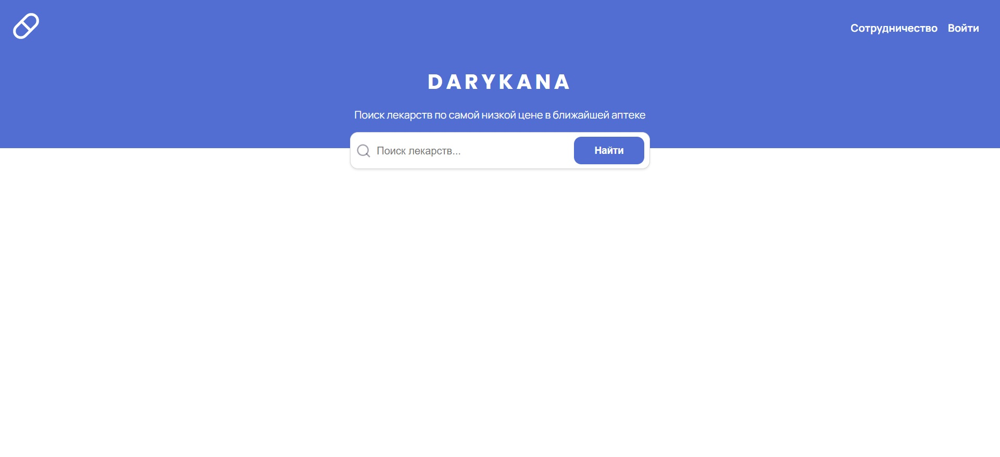

# DARYKANA
## Web App for drugs search
### This is my own failed startup. 
Darykana (kz.) - pharmacy.  The idea was to create a service in Bishkek to search for medicines in pharmacies in the city.  The site would show the availability of the drug in certain pharmacies and, accordingly, the prices.  The client could sort the list of pharmacies by distance/price/rating.
### The project has been shelved because it requires a lot of investment, primarily time. Maybe someday, I'll come back to him.
><b>React.js  Next.js
## [LIVE DEMO](https://darykana.vercel.app/)

